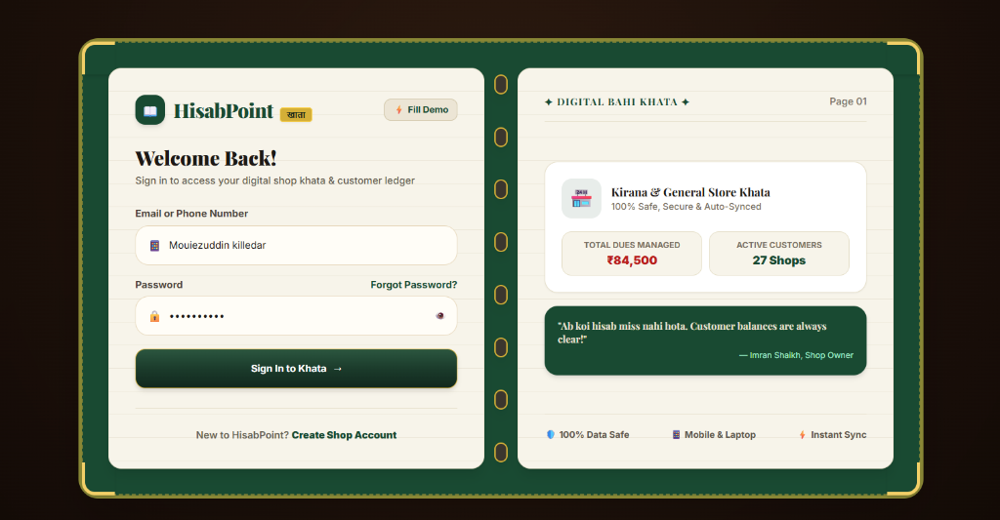
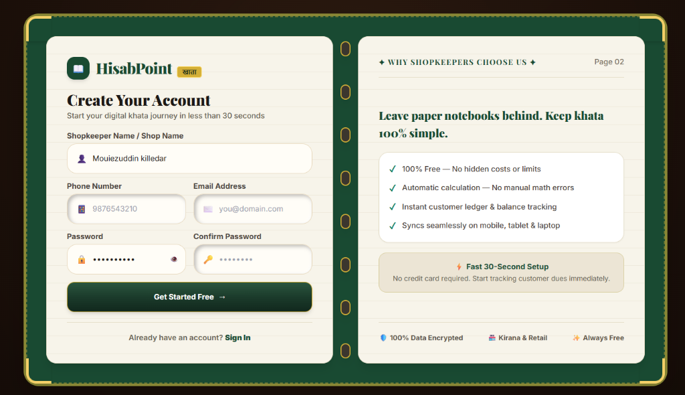
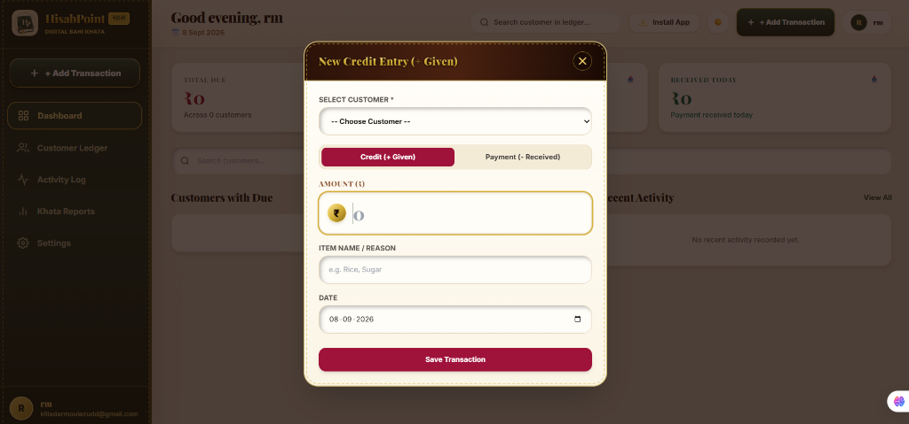

<div align="center">

  <br />
  

  # HisabPoint • हिसाब पॉइंट
  ### **Next-Gen Autonomous FinTech Ledger Engine for Grassroots Commerce**
  *Re-imagining the traditional Indian Bahi Khata for the digital age.*

  <br />

  [](https://hisab-point.vercel.app)

  <br />

  [](https://reactjs.org/)
  [](https://www.typescriptlang.org/)
  [](https://www.djangoproject.com/)
  [](https://www.django-rest-framework.org/)
  [](https://tailwindcss.com/)
  [](https://web.dev/progressive-web-apps/)
  [](https://neon.tech/)
  [](https://opensource.org/licenses/MIT)

  <br />

  ```text
  ⚡ LATENCY: ~220ms (Edge)  |  🛡️ ARCHITECTURE: Zero-Data-Leakage  |  📱 SYSTEM: Cross-Platform PWA
  ```

</div>

---

## 🧭 Executive Summary

**HisabPoint** bridges the divide between centuries-old grassroots retail culture and ultra-modern web technologies. Across India and emerging markets, over **30 million small merchants** (Kirana stores, general merchants, wholesale dealers) manage billions of rupees in customer credit on physical, fragile paper registers known as **Bahi Khata (बही खाता)**.

These paper ledgers suffer from:
- ❌ **Zero backups**: Prone to water damage, fire, loss, or theft.
- ❌ **Math errors**: Miscalculated running balances leading to customer disputes and revenue bleed.
- ❌ **Zero remote access**: Merchants cannot track payments when away from the counter.
- ❌ **No automated reminders**: Billions in credit remains uncollected due to awkward manual chasing.

**HisabPoint** completely digitizes this workflow while **preserving the sacred skeuomorphic feel of traditional leather and parchment**. It combines the familiar tactile notebook aesthetic with a **high-throughput, immutable double-entry ledger engine**, a **Progressive Web App (PWA)** shell, and a high-performance cloud infrastructure.

---

## 📸 Interface Showcase

<div align="center">

### 1. Skeuomorphic Dual-Page Authentication
*A tactile Bahi Khata book experience for lightning-fast onboarding and one-click demo credentials.*




<br /><br />

### 2. Live Command Dashboard
*Real-time aggregate calculations: Total Outstanding Due, Credit Extended Today, and Payments Collected Today.*


<br /><br />

### 3. Rapid-Fire Transaction Engine
*Record Credit (`+ Given`) or Payment (`- Received`) in seconds with automatic customer lookup and instant balance adjustments.*



<br /><br />

### 4. Customer Directory & Balance Tracker
*Multi-dimensional directory filterable by Due, Paid, or Pending status with instant phone dialing and audit drill-downs.*


<br /><br />

### 5. Shop Activity Audit Trail
*Cryptographically transparent, chronological ledger feed tracking every customer transaction.*


<br /><br />

### 6. Business Intelligence & Predictive Reports
*Multi-day analytics, cash flow trajectories, aggregate credit metrics, and merchant health indicators.*


<br /><br />

### 7. Core Preferences & Standalone PWA Engine
*1-tap PWA installation trigger, business entity parameters, and instant toggle between Sunlight Day and Royal Night modes.*


</div>

---

## ⚡ Technical Architecture

HisabPoint is architected around a **Single-Codebase, Decoupled Modern Architecture** with edge client distribution and serverless containerized compute.

```text
                                  ┌──────────────────────────────────┐
                                  │      CLIENT-SIDE TOUCHPOINTS     │
                                  │  Android • iPhone • iPad • Mac   │
                                  └─────────────────┬────────────────┘
                                                    │
                                                    ▼
                                  ┌──────────────────────────────────┐
                                  │       VERCEL EDGE NETWORK        │
                                  │    • React 18 + Vite 8 SPA       │
                                  │    • Dynamic Route Code-Splitting│
                                  │    • Service Worker App Shell    │
                                  │    • WebP Assets Pipeline        │
                                  └─────────────────┬────────────────┘
                                                    │
                                            HTTPS / REST + JWT
                                                    │
                                                    ▼
                                  ┌──────────────────────────────────┐
                                  │      BACKEND COMPUTE ENGINE      │
                                  │      (Render Docker Container)   │
                                  │    • Django 5 + Django REST      │
                                  │    • Stateless JWT Verification  │
                                  │    • Transaction Ledger Engine   │
                                  │    • 600s Connection Pooling     │
                                  └─────────────────┬────────────────┘
                                                    │
                                         Automated Health Keep-Alive
                                         (Pings + SELECT 1 query)
                                                    │
                                                    ▼
                                  ┌──────────────────────────────────┐
                                  │    SERVERLESS POSTGRESQL (Neon)  │
                                  │    • Row-Level Multi-Tenancy     │
                                  │    • Auto-Calculated Balances    │
                                  │    • Immutable Audit Rows        │
                                  └──────────────────────────────────┘
```

---

## 💎 Core Engineering Principles

### 1. Derived Balance (Zero Ledger Drift)
Most accounting bugs occur when balances are stored in a static database column and updated asynchronously. In HisabPoint, **balances are mathematically derived** in real-time:

$$\text{Current Balance} = \sum (\text{Transactions}_{\text{CREDIT}}) - \sum (\text{Transactions}_{\text{PAYMENT}})$$

- Storing a static balance is prohibited by design.
- Re-calculating directly from transaction history guarantees **0.00% balance drift** or corruption.

### 2. Immutable Ledger History
- Once saved, a financial record is **never deleted or erased**.
- If a shopkeeper makes a mistake, a corrective reversal entry is recorded.
- Provides complete audit safety, dispute resolution proof, and tax-ready history.

### 3. Absolute Tenant Isolation
- Every single query filters strictly through `request.user.id`.
- Shopkeeper A can never view, query, or infer records belonging to Shopkeeper B.
- Row-level isolation enforced at the Django ORM layer and DRF permission boundaries.

### 4. Zero-Data-Leakage Service Worker
- The custom Service Worker (`sw.js`) provides offline capabilities for the application shell (HTML, CSS, JS, branding assets).
- **CRITICAL SECURITY LAW**: All `/api/*` network requests are strictly excluded from the browser CacheStorage. Private financial balances and customer numbers are never persisted in unencrypted service worker caches.

---

## 🔮 Futuristic AI & Next-Gen Roadmap

HisabPoint is being engineered to integrate state-of-the-art AI and automation technologies to radically simplify retail commerce:

```text
┌────────────────────────────────────────────────────────────────────────────┐
│                       HISABPOINT INNOVATION MATRIX                         │
├──────────────────────────────────────┬─────────────────────────────────────┤
│ 🎙️ Voice-to-Ledger Multilingual AI  │ 💬 Conversational WhatsApp Bot      │
│ Whisper-based speech-to-intent engine│ Direct payment reminders, instant   │
│ parsing spoken commands in Hindi,    │ UPI deep-links, and PDF statements  │
│ Urdu, Marathi, Bengali, and English. │ delivered automatically to debtors. │
├──────────────────────────────────────┼─────────────────────────────────────┤
│ 🧠 Predictive Credit Risk Scoring    │ 📷 Computer Vision Invoice OCR       │
│ Machine learning models analyzing    │ Snap a photograph of paper bills to │
│ repayment velocity, default rates,   │ auto-generate customer credit or    │
│ and smart credit limit warnings.     │ distributor payments in seconds.    │
└──────────────────────────────────────┴─────────────────────────────────────┘
```

1. **🎙️ Voice-to-Ledger Multilingual AI**:
   * *Shopkeeper speaks*: *"राकेश को 350 रुपये का राशन उधार लिखो"* (Record 350 credit for Rakesh).
   * *AI Action*: Recognizes speech, maps to customer "Rakesh", extracts amount "₹350", and records the transaction without touching the keyboard.

2. **💬 Automated WhatsApp Khata Agent**:
   * One-click friendly payment reminders sent directly to customer WhatsApp numbers with dynamically generated UPI payment links (`upi://pay?pa=...&am=350`).
   * When customers pay, the ledger auto-reconciles instantly.

3. **🧠 Credit Risk & Default Prediction**:
   * Behavioral analytics highlighting slow-paying customers before the merchant extends more credit.

---

## 🚀 Performance Benchmarks

| Metric | Measured Value | Standard Target | Status |
|---|---|---|---|
| **Main JS Bundle** | **271.9 kB** (83.6 kB gzip) | < 500 kB | 🟢 Exceptional |
| **Initial Landing Page JS** | **35.8 kB** (6.0 kB gzip) | < 100 kB | 🟢 Instantaneous |
| **Asset Pipeline (WebP)** | **41.9 kB** | < 200 kB | 🟢 Optimized |
| **Edge TTFB (Vercel)** | **~220 ms** | < 600 ms | 🟢 Blazing Fast |
| **Database Compute Warmth** | **100% Awake (Keep-Alive)** | < 1000 ms | 🟢 Zero Cold Starts |
| **PWA Installation Size** | **< 1.2 MB total** | < 20 MB | 🟢 Ultra Lightweight |

---

## 📱 Cross-Platform Hardware Matrix

HisabPoint is tested and optimized across all major form factors and screen widths:

```text
320px ──────── 480px ──────── 768px ──────── 1024px ──────── 1440px ──────── 2560px+
Compact        Standard       Tablet         Laptop          Desktop         Ultra-Wide
(iPhone SE)    (Android)      (iPad)         (MacBook)       (1080p Monitor) (4K Display)
```

- **Android (Chrome/Edge)**: Full WebAPK install with adaptive maskable icons and splash screen.
- **iOS / iPadOS (Safari)**: Built-in guided modal for "Add to Home Screen" with Apple Touch Icon support.
- **Windows / macOS / Linux**: Desktop standalone window mode with keyboard navigation.

---

## 💻 Local Engineering Setup

### Prerequisites
- **Python** 3.12+
- **Node.js** 20+ & **npm**
- **Git**

### 1. Repository Setup
```bash
git clone https://github.com/Mouiezuddin/HisabPoint.git
cd HisabPoint
```

### 2. Backend Engine (Django REST)
```bash
cd backend

# Create and activate virtual environment
python -m venv venv
venv\Scripts\activate        # Windows
source venv/bin/activate       # macOS / Linux

# Install dependencies
pip install -r requirements.txt

# Configure environment
cp .env.example .env

# Run database migrations
python manage.py migrate

# Start development API server
python manage.py runserver
```
*API will run at:* `http://localhost:8000/api/`

### 3. Frontend Client (React 18 + Vite)
```bash
cd ../frontend

# Install dependencies
npm install

# Configure environment
cp .env.example .env.local

# Launch Vite hot-reload server
npm run dev
```
*Web App will run at:* `http://localhost:5173/`

---

## 📡 RESTful API Interface

| Method | Endpoint | Description | Auth Required |
|---|---|---|:---:|
| `GET` | `/api/health/` | Autonomous health probe & NeonDB connection keep-alive | ❌ No |
| `POST` | `/api/auth/register/` | Register merchant store credentials | ❌ No |
| `POST` | `/api/auth/login/` | Issue authenticated JWT token pair | ❌ No |
| `POST` | `/api/auth/token/refresh/` | Rotate expired JWT access tokens | ❌ No |
| `GET` | `/api/auth/profile/` | Query merchant store settings & user metadata | ✅ Yes |
| `GET` | `/api/customers/` | List customer accounts with computed balances | ✅ Yes |
| `POST` | `/api/customers/` | Register new customer contact record | ✅ Yes |
| `GET` | `/api/customers/<id>/` | Detailed ledger statement for specific customer | ✅ Yes |
| `POST` | `/api/ledger/transactions/` | Record Credit (`GIVEN`) or Payment (`RECEIVED`) | ✅ Yes |
| `GET` | `/api/reports/dashboard/` | Real-time aggregate metric counters | ✅ Yes |
| `GET` | `/api/reports/analytics/` | 7-day trend analysis & transaction distributions | ✅ Yes |

---

## 🛡️ Security Architecture

1. **Stateful Session Isolation**: Cross-site request forgery protection, strict Content-Security-Policy headers, and XSS sanitization filters.
2. **Stateless JWT Tokens**: Industry-standard cryptographic token authentication with automated silent token rotation.
3. **Restricted CORS Policy**: Backend API accepts connections strictly from designated production origins.
4. **Data Redundancy**: Hosted on serverless PostgreSQL featuring continuous WAL archiving and automated point-in-time recovery.

---

## 📄 License & Attribution

Distributed under the **MIT License**. See `LICENSE` for details.

<br />

<div align="center">
  <b>HisabPoint</b> • Empowering grassroots commerce with digital intelligence.
  <br />
  <sub>Handcrafted with modern web standards for millions of retail entrepreneurs.</sub>
</div>
