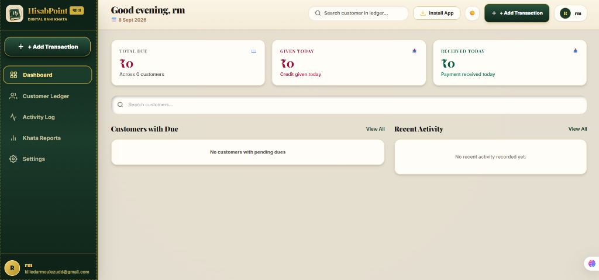
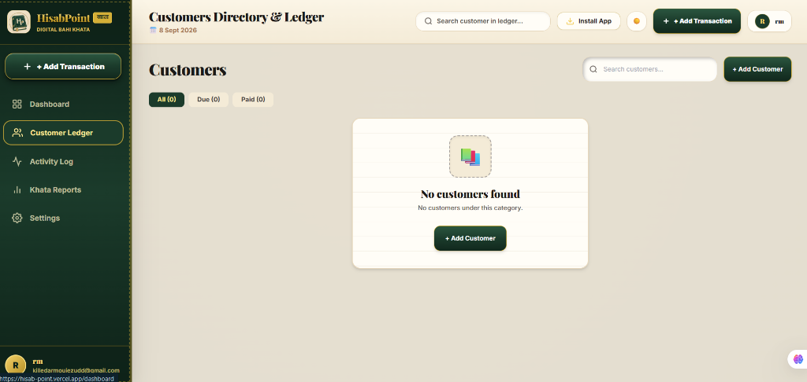
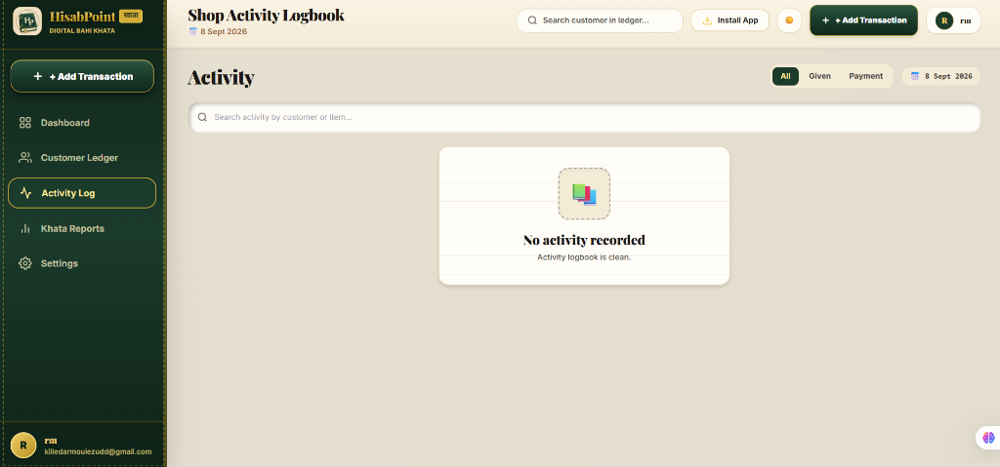
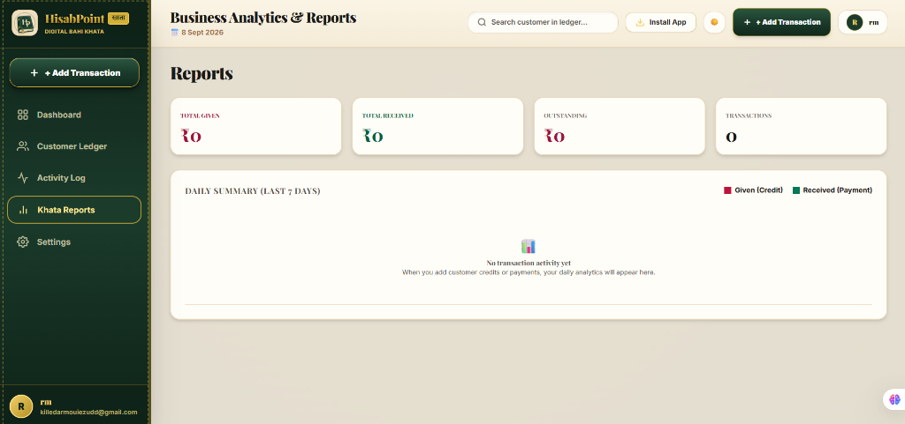
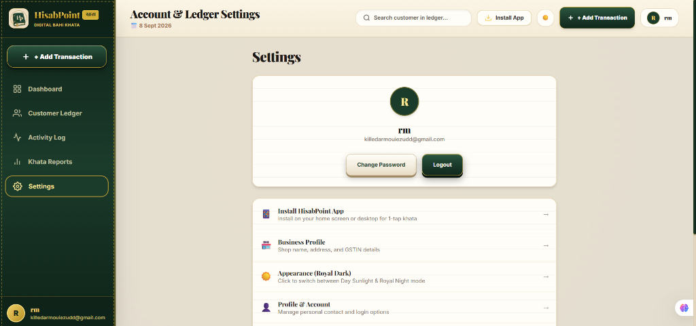

<div align="center">

  

  # HisabPoint (हिसाब पॉइंट)
  ### *Your shop’s khata, made digital.*

  [](https://reactjs.org/)
  [](https://www.typescriptlang.org/)
  [](https://www.djangoproject.com/)
  [](https://www.django-rest-framework.org/)
  [](https://tailwindcss.com/)
  [](https://web.dev/progressive-web-apps/)
  [](https://hisab-point.vercel.app)
  [](https://hisabpoint.onrender.com)
  [](https://opensource.org/licenses/MIT)

  <br />

  **[🌐 Live Web & PWA App](https://hisab-point.vercel.app)** • **[⚙️ Backend API](https://hisabpoint.onrender.com)** • **[🩺 Health Check](https://hisabpoint.onrender.com/api/health/)**

  <p align="center">
    A modern, mobile-first, and skeuomorphic Progressive Web App (PWA) designed for small Indian shopkeepers and retail businesses to replace traditional paper Bahi Khata notebooks with an instant, secure digital ledger.
  </p>

</div>

---

## 📸 Application Showcase

### 1. Dashboard Overview
Instant high-level snapshot of **Total Due**, **Credit Given Today**, and **Payments Received Today** with quick customer search and recent transaction logs.

<div align="center">
  
</div>

<br />

### 2. Customer Directory & Ledger
Quickly search, filter (All, Due, Paid), and manage customer accounts with one-tap access to credit/debit records.

<div align="center">
  
</div>

<br />

### 3. Shop Activity Logbook
Chronological audit log tracking every rupee given or collected across the entire shop with date and customer tags.

<div align="center">
  
</div>

<br />

### 4. Business Analytics & Reports
7-day daily summaries, aggregate given/collected totals, and actionable business health insights.

<div align="center">
  
</div>

<br />

### 5. Account & Ledger Settings
PWA installation trigger, business profile details, and one-click toggle between Sunlight Day and Royal Night skeuomorphic themes.

<div align="center">
  
</div>

---

## ✨ Key Features

- **📖 Skeuomorphic Bahi Khata Aesthetics**: Rich parchment textures, leather stitch borders, and brass/gold embossed accents that look and feel familiar to traditional shopkeepers.
- **📲 Full PWA Capabilities**: Installable directly on Android phones, iPhones (via Safari Share menu), tablets, laptops, and desktop computers with standalone window experience.
- **⚡ Blazing Fast Performance**:
  - Route code-splitting with `React.lazy` (< 270 kB main bundle).
  - High-efficiency WebP asset pipeline (< 45 kB logo & icons).
  - Sub-250ms Vercel edge delivery.
  - 24/7 database auto-warming probe eliminating serverless cold starts.
- **🛡️ Accounting Integrity & Auditability**:
  - Balance is dynamically calculated from ledger transactions — never manually altered.
  - Transactions are immutable (no arbitrary deletions; corrections use reversal entries).
  - Strict multi-tenant data isolation — users only see their own store records.
- **🌓 Dual Theme Support**: Seamless switching between **Sunlight Day Mode** (warm parchment) and **Royal Night Mode** (deep midnight leather).
- **📴 Offline App Shell**: Powered by custom Service Worker caching static assets while strictly bypassing financial APIs for data freshness.

---

## 🛠️ Technology Stack

### Frontend
- **Framework**: [React 18](https://react.dev/) + [TypeScript](https://www.typescriptlang.org/)
- **Build Tool**: [Vite 8](https://vitejs.dev/)
- **Styling**: [Tailwind CSS v3](https://tailwindcss.com/) with custom skeuomorphic tokens
- **Routing**: [React Router DOM v6](https://reactrouter.com/) (code-split with `React.lazy`)
- **Data Fetching**: [TanStack Query v5](https://tanstack.com/query) + [Axios](https://axios-http.com/)
- **PWA**: Custom Service Worker (`sw.js`) + W3C Web App Manifest
- **Hosting**: [Vercel](https://vercel.com/)

### Backend
- **Framework**: [Python 3.12](https://www.python.org/) + [Django 5](https://www.djangoproject.com/)
- **API Engine**: [Django REST Framework](https://www.django-rest-framework.org/)
- **Authentication**: JWT via `djangorestframework-simplejwt`
- **Database**: [PostgreSQL (Neon Serverless)](https://neon.tech/) in production, SQLite in local development
- **WSGI Server**: [Gunicorn](https://gunicorn.org/) + [WhiteNoise](https://whitenoise.readthedocs.io/)
- **Hosting**: [Render](https://render.com/) (Docker runtime) + [UptimeRobot](https://uptimerobot.com/) keep-alive

---

## 🚀 Quickstart & Local Setup

### 1. Clone Repository
```bash
git clone https://github.com/Mouiezuddin/HisabPoint.git
cd HisabPoint
```

### 2. Backend Setup
```bash
cd backend
python -m venv venv

# Windows
venv\Scripts\activate
# Linux/macOS
source venv/bin/activate

pip install -r requirements.txt
cp .env.example .env
python manage.py migrate
python manage.py runserver
```
Backend API will be accessible at: `http://localhost:8000/api/`

### 3. Frontend Setup
```bash
cd ../frontend
npm install
cp .env.example .env.local
npm run dev
```
Frontend web application will open at: `http://localhost:5173/`

---

## 📡 API Endpoints Overview

| Endpoint | Method | Description |
|---|---|---|
| `/api/health/` | `GET` | System health probe & NeonDB connection keep-alive |
| `/api/auth/register/` | `POST` | Register a new shopkeeper account |
| `/api/auth/login/` | `POST` | Authenticate and obtain JWT access/refresh tokens |
| `/api/auth/profile/` | `GET` / `PUT` | Retrieve or update user business profile |
| `/api/customers/` | `GET` / `POST` | List all customers or create a customer record |
| `/api/customers/<id>/` | `GET` / `PUT` | Get customer details and balance history |
| `/api/ledger/transactions/` | `GET` / `POST` | Record a Credit (Given) or Payment (Received) |
| `/api/reports/dashboard/` | `GET` | Aggregate stats: Total Due, Given Today, Received Today |
| `/api/reports/analytics/` | `GET` | 7-day business summary and transaction counts |

---

## 🔒 Security & Privacy

- **Never Caches Private Records**: The PWA Service Worker explicitly excludes `/api/*` endpoints from CacheStorage.
- **JWT Authorization**: Authenticated API requests require Bearer authorization tokens.
- **CORS Restricted**: Backend is locked down strictly to authorized frontend origins.
- **OWASP Compliant**: XSS filters, strict Content-Type sniffing prevention, and parameter sanitization enforced across all endpoints.

---

## 📄 License

This project is open source and available under the [MIT License](LICENSE).

<div align="center">
  <sub>Built with ❤️ for Indian shopkeepers and retail merchants.</sub>
</div>
